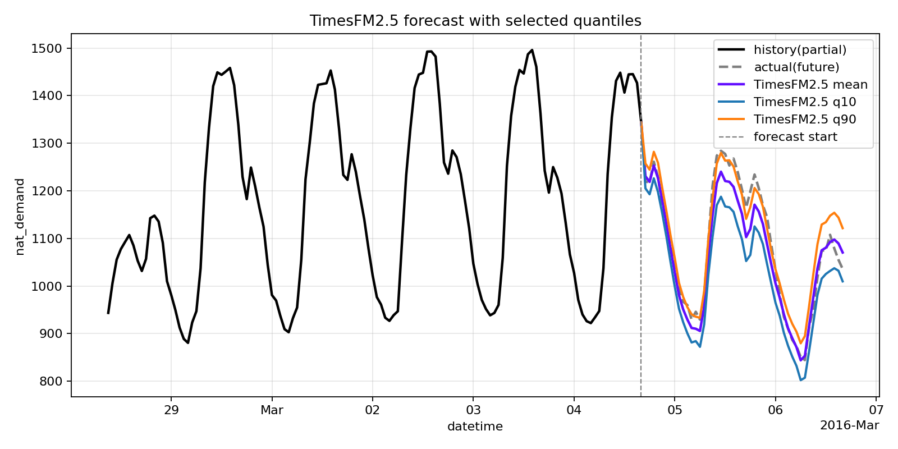

# Datalayers + TimesFM 2.5 Example

This example repository accompanies the **Datalayers + TimesFM 2.5 hands-on blog post**.
It demonstrates a complete minimal workflow:

1. Create a time-series table in Datalayers.
2. Load CSV data into the table.
3. Read data through FlightSQL.
4. Run forecasting with TimesFM 2.5.
5. Export forecast CSV and visualization.

## Environment Requirements

- Python `>= 3.10`
- A running Datalayers instance (with FlightSQL enabled). We recommend running Datalayers on docker.
- Network access from this project to your Datalayers service

## Required Python Dependencies

Install the required libraries in your environment:

```bash
pip install \
  pandas \
  matplotlib \
  flightsql-dbapi \
  kagglehub
```

Notes:
- It's required to install `timesfm2.5` directly from source code.

## Quick Start

1. Create database/table:

```bash
# Run sql in scripts/init_db.sql against your Datalayers SQL endpoint
# We provide `dlsql` to connect Datalayers server with following commands:
dlsql -h localhost -P 8360 -u admin -p public
# After entering the cli, you can create database using `CREATE DATABASE <dbname>`, and `exit` to exit.
# If you are not changed to the target database, use `use <dbname>` to enter your database.
```

2. Load CSV data:

```bash
python scripts/load_csv_via_flightsql.py \
  --csv /path/to/your/dataset.csv \
  --table <tablename> \
  --host localhost \
  --port 8360 \
  --user admin \
  --password public \
  --db <dbname>
```

3. Run forecasting and visualization:

```bash
python example/visualization.py
```

4. Check outputs:

- `outputs/timesfm25_forecast.csv`
- `outputs/timesfm25_visualization.png`



This setup is intended for experimentation and learning.
